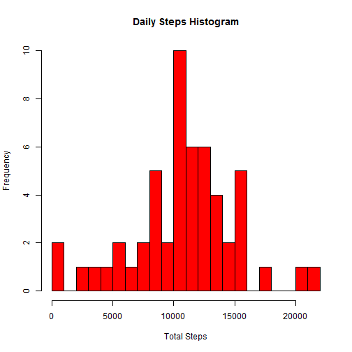
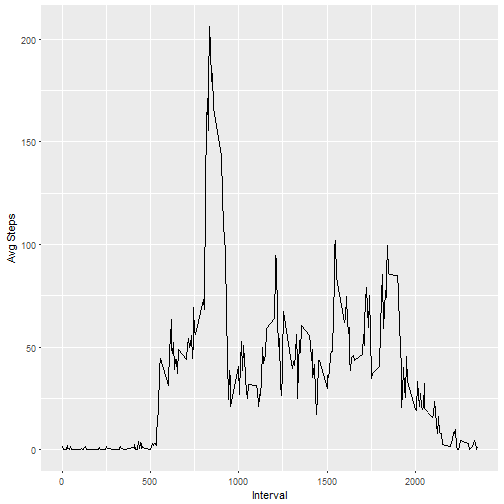
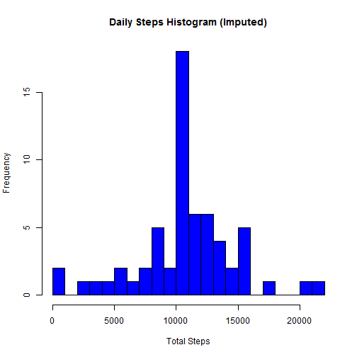
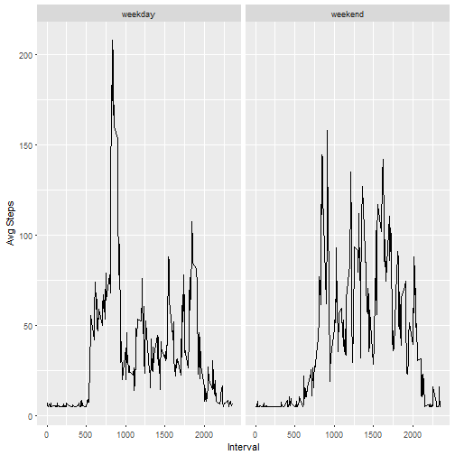

Reproducible Research - Week 2 Course Project
============================================

### Loading and preprocessing the data

```r
# 1 Load the datadata_url <- "https://d396qusza40orc.cloudfront.net/repdata%2Fdata%2Factivity.zip"
temp <- tempfile()
download.file(data_url, temp)
unzip(temp, "activity.csv")
Raw_Data <- read.csv("activity.csv")

# 2 Process/transform the data into a format suitable for your analysis
library(dplyr)
Raw_df <- tbl_df(Raw_Data)
Clean_df <- filter(Raw_df, !is.na(steps))
```

### What is the mean total number of steps taken per day?

```r
# 1 Calculate the total number of steps taken per day?
Daily_df <- group_by(Clean_df, date)
Daily_df <- summarise(Daily_df, total_steps = sum(steps))
Daily_df <- ungroup(Daily_df)

# 2 If you do not understand the difference between a histogram and a
# barplot, research the difference between them.  Make a histogram of the
# total number of steps taken each day
hist(Daily_df$total_steps, col = "red", breaks = 20, main = "Daily Steps Histogram", 
    xlab = "Total Steps")
```



```r
# 3 Calculate and report the mean and median of the total number of steps
# taken per day
summarise(Daily_df, Mean_Steps = mean(total_steps), Median_Steps = median(total_steps))
```

```
## # A tibble: 1 x 2
##   Mean_Steps Median_Steps
##        <dbl>        <int>
## 1   10766.19        10765
```

### What is the average daily activity pattern?

```r
# 1 Make a time series plot (i.e. type = 'l') of the 5-minute interval
# (x-axis) and the average number of steps taken, averaged across all days
# (y-axis)
library(ggplot2)
Interval_df <- group_by(Clean_df, interval)
Interval_df <- summarise(Interval_df, Avg_Steps = mean(steps))
Interval_df <- ungroup(Interval_df)

ggplot(Interval_df, aes(interval, Avg_Steps)) + geom_line() + xlab("Interval") + 
    ylab("Avg Steps")
```



```r
# 2 Which 5-minute interval, on average across all the days in the dataset,
# contains the maximum number of steps?
max_step <- summarise(Interval_df, Max_Steps = max(Avg_Steps))
Interval_max <- filter(Interval_df, Avg_Steps == max_step$Max_Steps)
Interval_max
```

```
## # A tibble: 1 x 2
##   interval Avg_Steps
##      <int>     <dbl>
## 1      835  206.1698
```

### Imputing missing values

```r
# 1 Calculate and report the total number of missing values in the dataset
# (i.e. the total number of rows with NAs)
Missing_df <- Raw_df[!complete.cases(Raw_df), ]
nrow(Missing_df)
```

```
## [1] 2304
```

```r
# 2 Devise a strategy for filling in all of the missing values in the
# dataset.  The strategy does not need to be sophisticated.  For example,
# you could use the mean/median for that day, or the mean for that 5-minute
# interval, etc
impute_val <- summarise(Clean_df, Mean_Steps = mean(steps))
Imputed_df <- mutate(Raw_df, impute_steps = ifelse(is.na(steps), impute_val$Mean_Steps, 
    steps))
Imputed_df
```

```
## # A tibble: 17,568 x 4
##    steps       date interval impute_steps
##    <int>     <fctr>    <int>        <dbl>
##  1    NA 2012-10-01        0      37.3826
##  2    NA 2012-10-01        5      37.3826
##  3    NA 2012-10-01       10      37.3826
##  4    NA 2012-10-01       15      37.3826
##  5    NA 2012-10-01       20      37.3826
##  6    NA 2012-10-01       25      37.3826
##  7    NA 2012-10-01       30      37.3826
##  8    NA 2012-10-01       35      37.3826
##  9    NA 2012-10-01       40      37.3826
## 10    NA 2012-10-01       45      37.3826
## # ... with 17,558 more rows
```

```r
# 3 Create a new dataset that is equal to the original dataset but with the
# missing data filled in.
Imputed_df_orig <- mutate(Raw_df, steps = ifelse(is.na(steps), impute_val$Mean_Steps, 
    steps))
Imputed_df_orig
```

```
## # A tibble: 17,568 x 3
##      steps       date interval
##      <dbl>     <fctr>    <int>
##  1 37.3826 2012-10-01        0
##  2 37.3826 2012-10-01        5
##  3 37.3826 2012-10-01       10
##  4 37.3826 2012-10-01       15
##  5 37.3826 2012-10-01       20
##  6 37.3826 2012-10-01       25
##  7 37.3826 2012-10-01       30
##  8 37.3826 2012-10-01       35
##  9 37.3826 2012-10-01       40
## 10 37.3826 2012-10-01       45
## # ... with 17,558 more rows
```

```r
# 4 Make a histogram of the total number of steps taken each day and
# calculate and report the mean and median total number of steps taken per
# day. Do these values differ from the estimates from the first part of the
# assignment?  What is the impact of imputing missing data on the estimates
# of the total daily number of steps?
Daily_df_impute <- group_by(Imputed_df_orig, date)
Daily_df_impute <- summarise(Daily_df_impute, total_steps = sum(steps))
Daily_df_impute <- ungroup(Daily_df_impute)

hist(Daily_df_impute$total_steps, col = "blue", breaks = 20, main = "Daily Steps Histogram (Imputed)", 
    xlab = "Total Steps")
```



```r
summarise(Daily_df, Mean_Steps = mean(total_steps), Median_Steps = median(total_steps))
```

```
## # A tibble: 1 x 2
##   Mean_Steps Median_Steps
##        <dbl>        <int>
## 1   10766.19        10765
```

```r
summarise(Daily_df_impute, Mean_Steps = mean(total_steps), Median_Steps = median(total_steps))
```

```
## # A tibble: 1 x 2
##   Mean_Steps Median_Steps
##        <dbl>        <dbl>
## 1   10766.19     10766.19
```

### Are there differences in activity patterns between weekdays and weekends?

```r
# 1 Create a new factor variable in the dataset with two levels - 'weekday'
# and 'weekend' indicating whether a given date is a weekday or weekend day.
Imputed_df_orig <- mutate(Imputed_df_orig, weekday = weekdays(as.Date(date, 
    "%Y-%m-%d"), abbreviate = TRUE))
Imputed_df_orig <- mutate(Imputed_df_orig, weekday_fct = ifelse(weekday == "Sat" | 
    weekday == "Sun", "weekend", "weekday"))
Imputed_df_orig$weekday_fct <- as.factor(Imputed_df_orig$weekday_fct)

# 2 Make a panel plot containing a time series plot (i.e. type = 'l') of the
# 5-minute interval (x-axis) and the average number of steps taken, averaged
# across all weekday days or weekend days (y-axis).  See the README file in
# the GitHub repository to see an example of what this plot should look like
# using simulated data.
Interval_df2 <- group_by(Imputed_df_orig, weekday_fct, interval)
Interval_df2 <- summarise(Interval_df2, Avg_Steps = mean(steps))
Interval_df2 <- ungroup(Interval_df2)

my_plot <- ggplot(Interval_df2, aes(interval, Avg_Steps)) + geom_line() + xlab("Interval") + 
    ylab("Avg Steps")
my_plot + facet_grid(. ~ weekday_fct)
```


